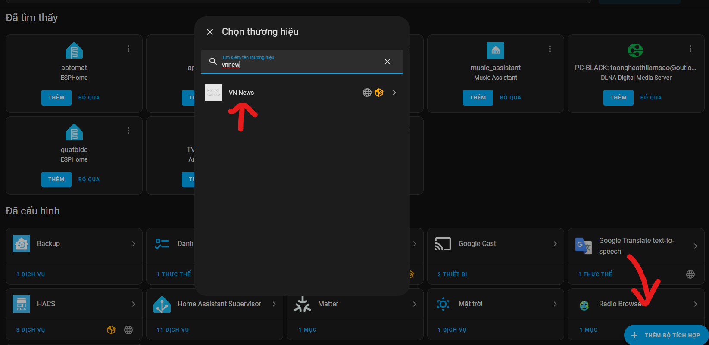
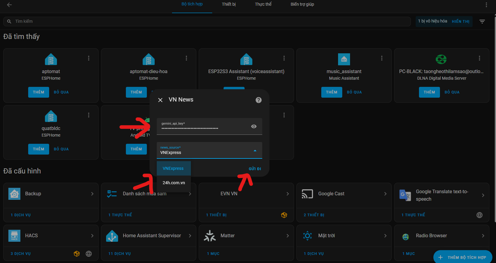
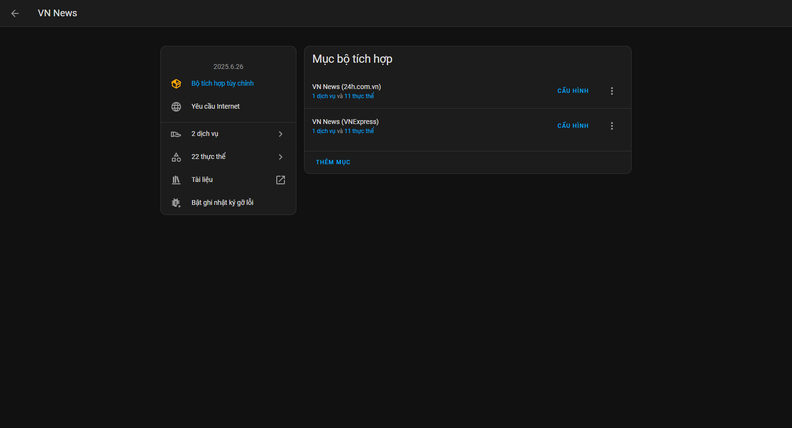
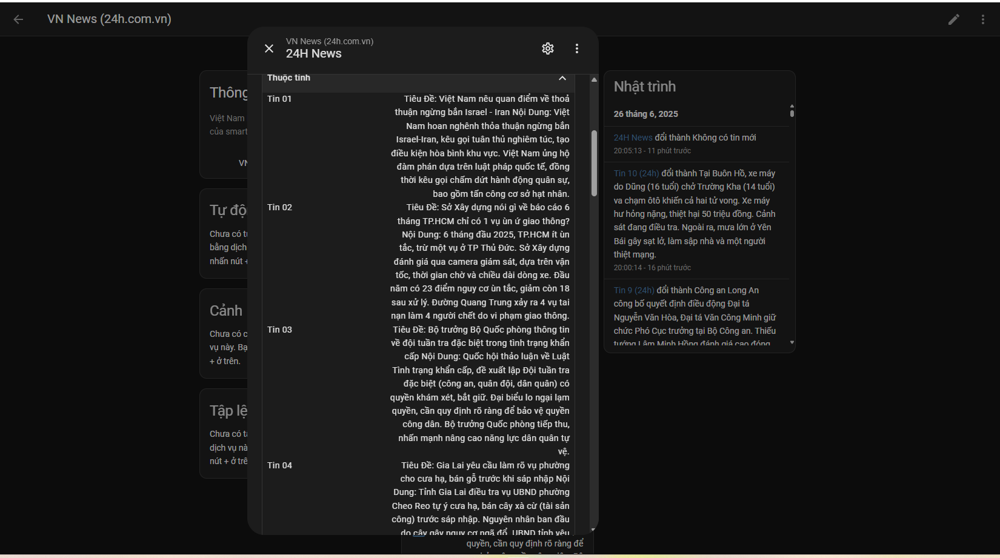
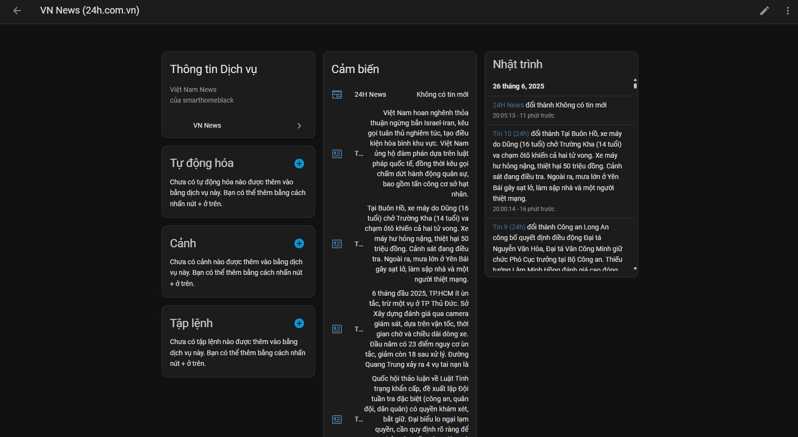

# 📰 VNExpress News Sensor for Home Assistant

Tự động lấy và tóm tắt tin tức mới nhất từ VnExpress bằng AI Gemini, hiển thị trực tiếp trong Home Assistant dưới dạng sensor.

---

## 🚀 Hướng Dẫn Cài Đặt

### 1. Tải Về & Cài Đặt

#### Cách 1. Cài tự động qua HACS

- Vào HACS -> Thêm kho lưu trữ tùy chỉnh, chọn Bộ tích hợp:
`https://github.com/smarthomeblack/vnnews`

- Sau đó tìm VN News hoặc bấm vào nút bên dưới

[](https://my.home-assistant.io/redirect/hacs_repository/?owner=smarthomeblack&repository=vnnews)

- Tải về sau đó khởi động lại Home Assistant

#### Cách 2.  Cài thủ công
- Tải và giải nén dự án này.
- Copy thư mục `vnnews` vào thư mục `custom_components` của Home Assistant.

## 📂 Cấu Trúc File

```
├── configuration.yaml
├── custom_components/
│   ├── vnnews/
│   │   ├── __init__.py
│   │   ├── manifest.py
│   │   ├── sensor.py
│   │   └── ...

```

5. **Khởi động lại Home Assistant.**

---

### 1A. Thêm Bộ tích hợp

- Vào Cài Đặt -> Thiết Bị -> Thêm Bộ Tích Hợp.
- Tìm VNNEWS để thêm, sau đó cấu hình key gemini api và chọn nguồn rss
- Lưu ý chỉ nên chọn 1 nguồn tin RSS để dùng, tránh API bị quá tải dẫn tới hết hạn mức request 
- Lần đầu chạy sẽ **mất khoảng vài phút** do cần tạo tóm tắt cho ~30 tin.
- Mỗi lần chạy sau chỉ tóm tắt tin mới, nhanh hơn (~10-15 tin mỗi 30 phút).
- Tin tức được lưu vào file `news.db` để tránh gọi lại AI cho các tin cũ.





---

## ⚙️ Cách Thức Hoạt Động

1. Lấy toàn bộ tin tức mới từ RSS VnExpress hoặc 24h
   (tối đa ~30 tin gần nhất)

2. Các bài viết mới sẽ được:
   - **Lấy nội dung đầy đủ**
   - **Tóm tắt bằng Gemini AI**

3. **Mỗi 30 phút**, sensor tự động cập nhật lại và thêm các tin mới.

4. Trạng thái sensor hiển thị:
   - `"Không có tin mới"`
   - hoặc `"Có X tin mới"` kèm các thuộc tính chi tiết từng bài viết.
   - Các Sensor Tin 1 - Tin 10 sẽ hiển thị trạng thái là nội dung tin tức tóm tắt mới nhất, dễ dàng cho việc voice
---

## 🖼 Demo







---

## 📌 Ghi Chú

- Dự án giới hạn 30 bài viết gần nhất để tối ưu hiệu năng.
- API Gemini nên là bản có quota ổn định.
- Nếu sensor không cập nhật ngay, có thể do chu kỳ quét mặc định là 30 phút.

---

## 💬 Liên Hệ & Góp Ý

Mọi đóng góp hoặc vấn đề vui lòng tạo [Issue tại đây](https://github.com/smarthomeblack/vnnews/issues) hoặc liên hệ qua GitHub.

---
